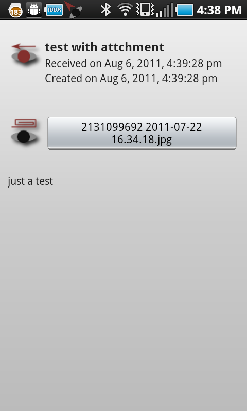
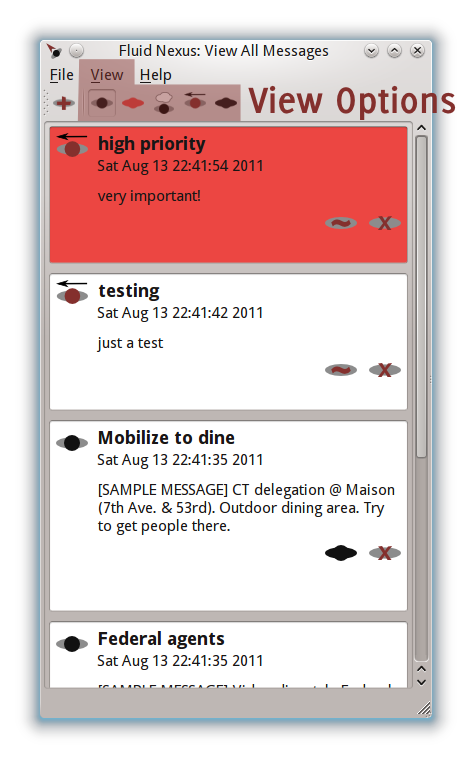
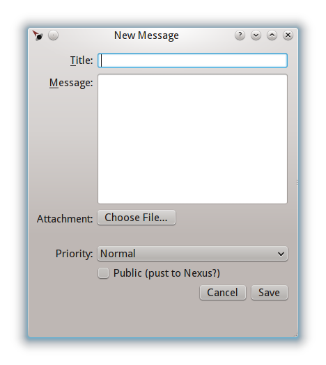
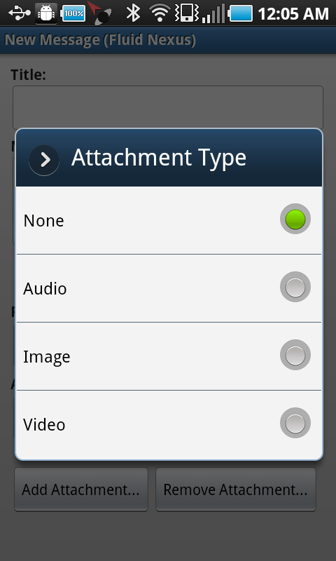
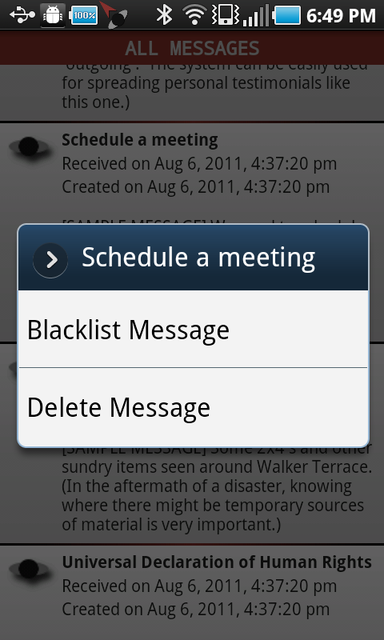
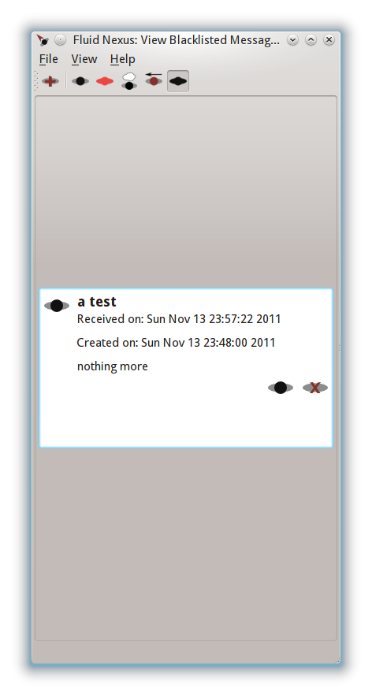
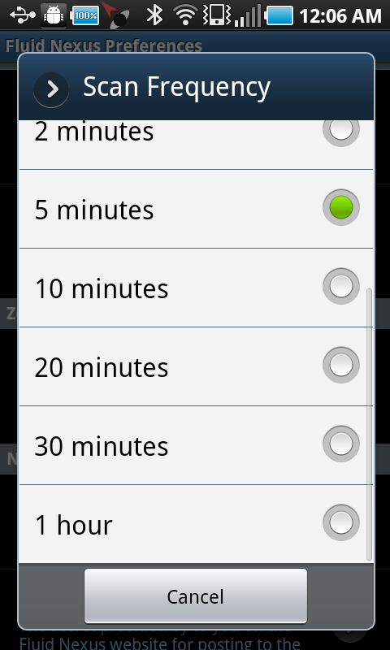
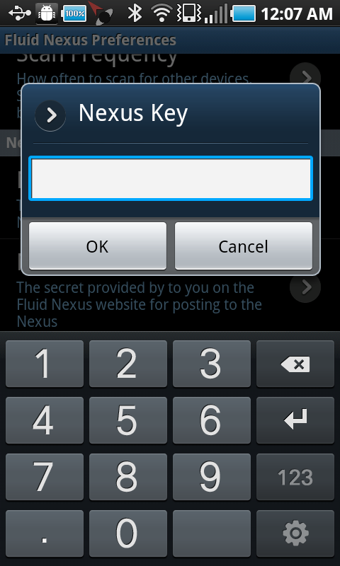

=======================================
Fluid Nexus Manual
=======================================

.. ------------------------------------
.. TODO

.. contents::
.. sectnum::
.. footer:: Document generated from reStructuredText_ plaintext markup source
            on |date| at |time|.

.. |date| date::
.. |time| date:: %H:%M:%S

.. |copy| unicode:: U+000A9 .. COPYRIGHT SIGN

Meta
====

Authors
-------

- Nicholas Knouf <nknouf [[at]] zeitkunst {{dot}} org>

Suggestions, Errata, and Translations
--------------------------------------

All are welcome.  Please contact the author.

Introduction
============

In the second decade of the twenty-first century, networks continue to be defined by their stable topology represented in an image or graph.  Peer-to-peer technologies promised new arrangements absent centralized control, but they still rely on stationary devices.  Mobile phones remain wedded to conventional network providers.

Instead, the combination of peer-to-peer with mobility enables a new concept of an information transfer infrastructure that relies on fluid, temporary, ad-hoc networks.  People and devices are at once implicated as mobile nodes in this network (known in computer science as a `sneakernet <http://en.wikipedia.org/wiki/Sneakernet>`_).

Fluid Nexus bypasses Internet intermediaries' control over the identification and circulation of messages.  This makes Fluid Nexus an important tool for activists.  Access to the data stored by Fluid Nexus requires a search warrant for *your own* devices---or another device running the software.  No identifying information regarding the sender is attached to a message, putting the sender in control.  And in conjunction with other software such as `ObscuraCam <https://guardianproject.info/apps/securecam/>`_ identities can be further obfuscated as desired or necessary.

In the event that information needs to reach a broad audience, we've added another feature called the `Nexus <http://fluidnexus.net/nexus>`_.  The Nexus is a space on this site for "public" messages to be automatically uploaded by any Fluid Nexus user.  The Nexus includes text, audio, images, and video capabilities.  The sender has control whether the message will become public or not.

For more information on Fluid Nexus, see the paper "`Transnetworks and the Fluid Nexus Project`_", forthcoming in Fall 2011 in the proceedings of dis/connecting/media 2009.

Articles of Interest
--------------------

* `U.S. Underwrites Internet Detour Around Censors <https://www.nytimes.com/2011/06/12/world/12internet.html?pagewanted=1&_r=1&hp>`_

* `Busting Egypt's web blackout: Savvy Egyptians using dial-up connections, unused ports to stay connected <http://www.cbc.ca/news/technology/story/2011/01/28/f-egypt-web-blackout.html>`_

* `Humans Are The Routers <http://techcrunch.com/2011/02/27/humans-are-the-routers/>`_

* `New project enables mobile phone use in areas with no reception <http://www.physorg.com/news198298057.html>`_

* `New York man accused of using Twitter to direct protesters during G20 summit <http://www.guardian.co.uk/world/2009/oct/04/man-arrested-twitter-g20-us?INTCMP=SRCH>`_

* `New York City Subpoenas TXTmob For All Text Messages Sent At Republican Convention <http://www.techdirt.com/articles/20080330/234737699.shtml>`_

Terminology & Icons
===================

In this manual **Android** refers to the Android application, while **Desktop** refers to the application for Windows and Linux PCs.

The following icons are used throughout the manual and in the applications themselves:

.. |menu_outgoing| image:: images/menu_outgoing.png
    :alt: Outgoing messages
    :width: 48px

|menu_outgoing| Outgoing messages
    Messages that you've created and that will be passed to other devices running Fluid Nexus

|menu_high_priority| High priority messages
    Messages that have been marked as high priority; these can be considered *life or death* messages.

|menu_public| Public messages created by you
    Messages that you have marked as public and will be pushed by yourself or someone else to the Nexus

.. |menu_public_other| image:: images/menu_public_other.png
    :alt: Public messages created by someone else
    :width: 48px

|menu_public_other| Public messages created by someone else
    Messages that someone else has marked as public and will be pushed by yourself or someone else to the Nexus

.. |menu_all| image:: images/menu_all.png
    :alt: Other messages
    :width: 48px

|menu_all| Other messages
    Messages that you've received from other users of Fluid Nexus

|menu_blacklist| Blacklisted messages
    Messages that you've blacklisted (removed from view)

.. |attachment_icon| image:: images/attachment_icon.png
    :alt: Attachment
    :width: 48px

|attachment_icon| Message attachment
    Indicates that the given message has an attachment of some sort (audio, image, video)

Security
========

Identifying Information
-----------------------

Data is stored unencrypted in a local sqlite database.  It is best that you     take care of encryption yourself, such as by using ecryptfs home directories or LUKS encrypted devices on Linux.  For Android we plan on implementing `SQLCipher <https://guardianproject.info/code/sqlcipher/>`_ in the near future.

Data is sent over Bluetooth_ without any transport layer encryption.  This is    something we plan on implementing in the future.

Data is sent over link-local wifi using zeroconf for service discovery without  any transport layer encryption.  This is something we plan on implementing in   the future.

While we do not save any identifying information, it is possible that you may inadvertently identify yourself through something you write or share using Fluid Nexus.  Please take this into account when using the software.  On Android, we suggest the use of `ObscuraCam <https://guardianproject.info/apps/securecam/>`_ to anonymize any photos that you decide to share.

Data Sharing
------------

Bluetooth
+++++++++

On Android, devices must be paired before any data sharing can occur.  This should happen in a safe location prior to an event.  Because of this need for pairing it is less likely that those unknown to you will be able to access Fluid Nexus messages *when you are using the Bluetooth_ network modality alone*; however, it is still possible that someone can sniff your Bluetooth traffic and thus see what messages are being sent.

On the Desktop in our testing we have not needed to pair devices ahead of time to share data amongst Linux and Windows clients.  Reports from other uses would be welcome.

Zeroconf
++++++++

On Android and the Desktop, devices will share messages with *any other device running Fluid Nexus*.  This means that others, whom you do not know, will be able to receive Fluid Nexus message (but Fluid Nexus Messages alone) from your device.  This is by design, as Fluid Nexus is a broadcast flooding protocol, meant to spread messages as far and as wide as possible.  Please take care to remove identifying information if you deem this to be a risk.

Using Fluid Nexus
=================

The main interface provides a list of all of the messages that have been created or received, sorted from newest to oldest.

.. figure:: images/android_main_interface.png
    :alt: android main interface
    :width: 400px

    Main interface of the Android application.

.. figure:: images/desktop_main_interface.png
    :alt: desktop main interface
    :width: 400px

    Main interface of the Desktop application.

Due to the small screen size on Android, you must tap on a message to view it in its entirety:

.. figure:: images/android_view_message.png
    :alt: android view message
    :width: 400px

    Viewing a message (Android)

If there is an attachment, a button will appear that will allow you to open it.

    Viewing a message with an attachment (Android)

On the desktop version, all of the message is displayed in the main window.  If there is an attachment, an icon will be displayed with a blue clickable link to open it.

.. figure:: images/desktop_main_interface.png
    :alt: desktop main interface
    :width: 400px

    Attachments can be opened on the desktop by clicking the blue underlined link.

You can further sort messages by their message type via the application menu (Android) or the "View" menu/toolbar buttons (Desktop).  This allows you to view all messages (the default), messages to be sent to the Nexus, only those you have created and are thus "outgoing", and blacklisted messages.

.. figure:: images/android_menu.png
    :alt: android menu
    :width: 400px

    Android menu

    Options for viewing different message types on the desktop version.  On the toolbar, from left to right the options are: all, nexus messages, outgoing messages, and blacklisted messages.

Creating a new message
----------------------

New messages can be created by selecting the "New Message" menu item on Android or by clicking the "New Message" button on the Desktop toolbar (also available under the "File" menu).  This will open up a new message window.

    Android new message window 

    Desktop new message window

Fill out the desired title and message.  Messages can be marked as potentially being sent to the Nexus by checking "Public (push to Nexus?)".  Attachments can be added as well.  In the Desktop application simply press "Choose File..." to open up a file dialog and select the desired attachment.  On Android, select the type of attachment (audio, image, video) and then tap "Add Attachment..." to open up the native file choosing application.

You can also set the "priority" of the message.  Currently there are two options: "Normal" and "Life or Death".  *Only use the "Life or Death" option if someone's life depends on receiving the message*.

    Selecting an attachment type on Android

Once complete, you can remove an attachment if desired by tapping "Remove Attachment..." on Android or clicking "Remove File" on the Desktop.

    Completed new message window on Android

.. figure:: images/desktop_new_message_complete.png
    :alt: desktop new message complete
    :width: 400px

    Completed new message window on the Desktop

To save, simply tap the "Back" button on Android, where you will be presented a confirmation dialog, or click "Save" on the Desktop.

.. figure:: images/android_new_message_save.png
    :alt: android new message save
    :width: 400px

    Save new message dialog on Android

Editing Messages
----------------

Messages you create can be edited or deleted, while messages you receive can be deleted or blacklisted.  On Android, to edit or delete a message you have created, long tap the desired message in the main window to open up a context menu.

    Android outgoing context menu

.. |delete_icon| image:: images/menu_delete.png
    :alt: Delete message
    :width: 32px

.. |blacklist_icon| image:: images/menu_blacklist_desktop.png
    :alt: Blacklist message
    :width: 32px

.. |unblacklist_icon| image:: images/menu_unblacklist.png
    :alt: Unblacklist message
    :width: 32px

On the Desktop, click the |edit_icon| edit message icon or the |delete_icon| delete message icon to do the same.

For messages you have received you either blacklist or delete the message; long tap on Android the desired message to bring up the menu.

    Android received message context menu

On the Desktop, click the |blacklist_icon| blacklist message icon or the |delete_icon| delete message icon to do the same.

Once a message is on the blacklist you can only view it by selecting the "Blacklist" view.  Once there you can remove it by, on Android, long tapping on the desired message and selecting "Unblacklist Message".

.. figure:: images/android_context_menu_unblacklist.png
    :alt: android blacklist context menu
    :width: 400px

    Android blacklisted message context menu

    Desktop blacklist view

On the desktop, click the |unblacklist_icon| unblacklist message icon.

Preferences
-----------

Both the Android and the Desktop applications have preferences that allow you to control how the applications behave.

General
+++++++

On both Android and the Desktop is an option whether or not to pass along messages you have blacklisted.  If checked, blacklisted messages will be sent.

On Android you additionally have an option to vibrate when new messages arrive.

Network
+++++++

The "Network" section provides checkboxes to enable or disable particular network modalities.  Fluid Nexus is opportunistic and tries to use whatever modality is available to spread messages.  Multiple modalities can run in parallel without problems.  At the moment we have implemented three modalities:

* Bluetooth_: connects to nearby devices running Fluid Nexus.  On Android, attempts to connect to paired Bluetooth devices only.
* Zeroconf_: uses the zeroconf protocol to discover nearby devices running Fluid Nexus and therefore transfer data over wireless or wired networks.  This can occur even if you do not have an Internet connection, as data passes only "link-local", meaning behind a single router.
* Nexus: tries to connect to the Internet to push messages marked as public to the Nexus.

    Android preferences screen

.. figure:: images/desktop_preferences.png
    :alt: desktop preferences
    :width: 400px

    Desktop preferences screen

Ad-Hoc Wifi is still under development.

Bluetooth
+++++++++

For the Android version you have the additional option to only connect to previously paired or "bonded" devices.  This will skip the device discovery step.  While saving battery life, connecting to bonded devices also adds a small layer of security by only sharing data between devices that you already know about.

Scan Frequency
++++++++++++++

For each of the network modalities (with the exception of "Nexus") you also have the possibility of setting the "Scan Frequency"; this is the amount of time between successive scans for nearby devices.  Lower values mean more frequent scans.  On Android, low values for the Bluetooth_ Scan Frequency will *severely* impact battery life.

    Android bluetooth scan frequency

    Desktop bluetooth scan frequency

Nexus
+++++

Finally, the "Nexus" section allows you to set your key and secret for posting to the Nexus.  To set this up, first register for an account at http://fluidnexus.net (by either creating a new account there or by logging in using your Google Account).  Then, on your user page click "Request  a key and secret".  Enter these 20-digit numbers into the corresponding boxes in your Android or Desktop application.

.. figure:: images/android_preferences_nexus.png
    :alt: android nexus preferences
    :width: 400px

    Android Nexus Preferences

    Entering a Nexus key on Android

.. figure:: images/desktop_preferences_nexus.png
    :alt: desktop nexus preferences
    :width: 400px

    Desktop Nexus Preferences

Then, request authorization from within the application.  On Android, open the menu and select "Request Nexus Authorization"; on the Desktop click the "Request Nexus Authorization" button.

.. figure:: images/android_menu_more.png
    :alt: android menu extension
    :width: 400px

    Android menu showing "Request Nexus Authorization" option

You will be forwarded to the Fluid Nexus website; you must be logged in in order to proceed.  Once you have granted authorization to the application (Android or Desktop) to post to the Nexus, you need to setup the Token and Token Secret.  On Android, these are filled in automatically for you; on the Desktop, you need to copy and paste these values from the website into the corresponding boxes.

Technical Information
=====================

Protocol Buffer implementation
------------------------------

Fluid Nexus uses protocol buffers to share data.  The following documents our message format::

    message FluidNexusHashes {
        repeated string message_hash = 1;
    }
    
    message FluidNexusMessage {
        optional string message_title = 1;
        optional string message_content = 2;
        optional float message_timestamp = 3;
        optional float message_received_timestamp = 10;
        optional string message_hash = 4;
        optional string message_source = 5;
        optional bool message_mine = 6;
        optional bool message_public = 16;
        optional int32 message_ttl = 17 [default = 0];
    
        enum MessageType {
            TEXT = 0;
            AUDIO = 1;
            IMAGE = 2;
            VIDEO = 3;
        }
    
        optional MessageType message_type = 7;
        optional bytes message_attachment = 8;
        optional string message_attachment_original_filename = 9;
    }
    
    message FluidNexusMessages {
        repeated FluidNexusMessage message = 1;
    }

Note that no directly identifying information is either sent in the message nor saved in the database.  The only way identifying information might be saved is via anything placed in the message itself.  Also note that there are no limitations on the length of the message.

The application uses a SHA256 hash of the message title and message content to determine whether or not the message needs to be exchanged.  These hashes are first exchanged between devices to determine what needs to be sent.  Thus Fluid Nexus uses a type of `distributed hash table <https://secure.wikimedia.org/wikipedia/en/wiki/Distributed_hash_table>`_ with the goal of replicating the entire table amongst all devices.

Network Modalities
------------------

Fluid Nexus currently works using Bluetooth_ and Zeroconf_ service discovery, with Ad-Hoc Wifi to be developed.  Android requires Bluetooth devices to be paired before any data sharing can occur.  On the Desktop, sharing between *discoverable* Linux devices does not require pairing beforehand.  (Windows is to be determined.)  Zeroconf does not require any pairing and thus messages will be shared between any device running Fluid Nexus and discoverable using Zeroconf service discovery.

.. -----------------------------
.. FOOTER
.. -----------------------------

.. _reStructuredText: http://docutils.sourceforge.net/rst.html
.. _Zeroconf: http://fluidnexus.net/favicon.ico
.. _Bluetooth: https://secure.wikimedia.org/wikipedia/en/wiki/Bluetooth
.. _Transnetworks and the Fluid Nexus Project: http://fluidnexus.net/static/pdfs/DCM2009Submitted.pdf
